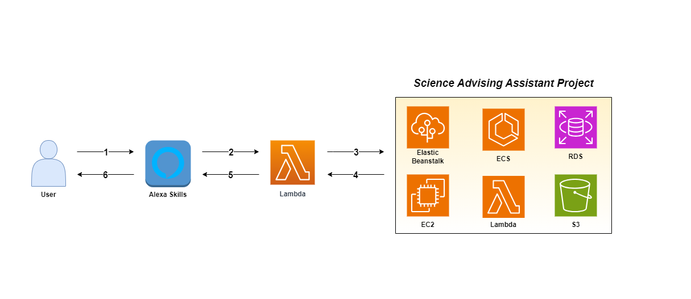

# Student Advising Voice Assistant

This is a voice assistance feature for the [student advising assistant project](https://github.com/UBC-CIC/student-advising-assistant), where you can interact with the question answering system through Alexa. For more information visit the [CIC website].

| Index | Description |
| ----- | ----------- |
| [High Level Architecture](#high-level-architecture) | High level overview illustrating component interactions |
| [Deployment](#deployment) | How to deploy the project |
| [User Guide](#user-guide) | The working solution |
| [Development](#development) | Information about the application's development |
| [Directories](#directories) | Project's general directory structure |
| [Changelog](#changelog) | Any changes post publish |
| [Credits](#credits) | Meet the team behind the solution |
| [License](#license) | License details |

## High Level Architecture
The following architecture diagram illustrates the various AWS components utilized to deliver the solution. For an in-depth explanation of the frontend and backend stacks, refer to the [Architecture Design]().


## Deployment
For instructions on how to deploy the application, refer to the [Deployment Guide](./docs/DeploymentGuide.md).

## User Guide
For instructions on how interact with the application via Alexa, refer to the [User Guide]().

## Development
For information on how the application was developed, refer to [Development Document]().

## Directories
```
├── bin
├── docs
│   └── images
├── lambda
├── layers
├── lib
├── skills
│   └── skill-package
```
1. `/bin`: Contains the instantiation of CDK stack
2. `/docs`: Contains documentation for the application
    - `/images`: Contains images used for the application
3. `/lambda`: Contains the code for lambda function associated with Alexa Skill
4. `/layers`: Contains the zip file that incorporates all the dependencies required to run lambda function
5. `/lib`: Contains the deployment code for the stack of the infrastructure
6. `/skills`: Contains the deployment code for Alexa Skill

## Changelog
N/A

## Credits
This application was architected and developed by Kotaro Ito, with project assistance by Franklin Ma. A special thanks to the UBC Cloud Innovation Centre Technical and Project Management teams for their guidance and support.

## License
This project is distributed under the [MIT License]().
