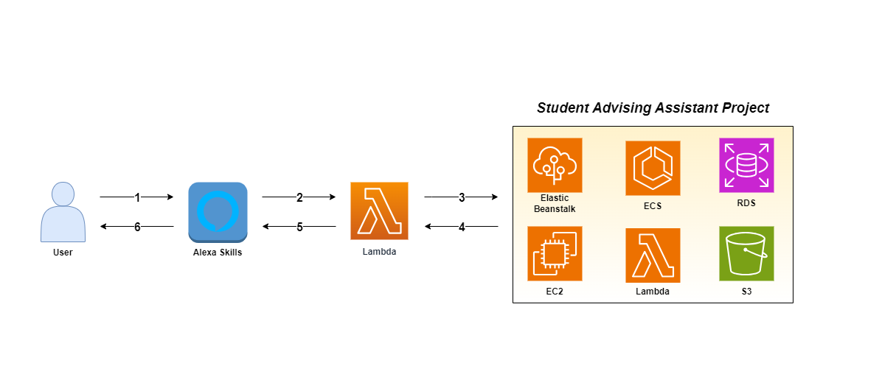

# Architecture Design #

This document provides a more in-depth explanation of the system's architecture and operation.

## Table of Contents ## 
- [Introduction](#introduction)
- [Architecture Diagram](#architecture-diagram)

## Introduction ##

This voice assistant feature is designed for [Student Advising Assistant](https://github.com/UBC-CIC/student-advising-assistant) project.  

## Architecture Diagram ##

### Question Answering ###
**1. User makes a request to the Alexa-enabled device.**
  - Users can start up the skill (application) by saying “Alexa, open student advising”.
  - When prompted to answer their faculty/program/year level, users can answer their name/value (e.g. Faculty of Science/Bachelor of Science/Third year).
  - When prompted to answer their specialization, users need to answer their subject first (e.g. Computer Science, Mathematics, etc), then answer the full name of their specialization (e.g. Major Computer Science, Honours Mathematics, etc).

**2. Alexa first converts voice to text, uses Natural Language Understanding(NLU) to interpret the user's request and calls the backend service that runs as an AWS Lambda function to handle the request.**

**3. AWS Lambda function acts as a request handler and calls the API defined in the Student Advising project to retrieve the answer.**
- API is hosted on AWS Elastic Beanstalk
- Each API route is defined for a single responsibility.
- When users choose the question type (either general or program-specific question), it accesses the `/faculties` route of the API to obtain a list of faculties.
- When users answer their faculty, it interacts with the API by accessing the `/programs` route to retrieve the list of programs associated with the selected faculty.
- When users answer the subject name of their specialization, it accesses the `/specializations` route to retrieve the list of relevant specializations.
- When users submit a question, it accesses the `/question` route of the API so that it calls the question-answering system defined in the Student Advising Project, and generates the answer for the given question. To find out more about how the response is generated, you can find the information [here](https://github.com/UBC-CIC/student-advising-assistant/blob/main/docs/ArchitectureDesign.md#aws-infrastructure).

**4. The generated response is sent back from the Student Advising Assistant to the Lambda handler in the form of a JSON-formatted data object.**
- `/faculties`: returns the list of UBC faculties.
- `/programs`: returns the list of programs associated with the faculty the user is in.
- `/specializations`: returns the list of specializations related to the subject name the user selected.
- `/question`: takes in the question as an argument, and calls the question-answering system in the Student Advising Project to generate the response to the question.

**5. Lambda receives the answer as an HTTP response. The response is sent back in JSON format and contains the necessary data to update the Alexa Skill. It reads the data, updates entities accordingly, and then prepares the confirmation message to send back to the device.**

**6. Alexa interprets the response, converts text to voice, and speaks the answer back to the user. If needed, it asks for additional information to the user (e.g. program, specialization, year level, etc)**.
