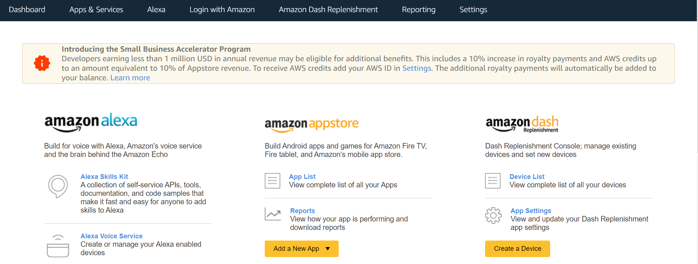
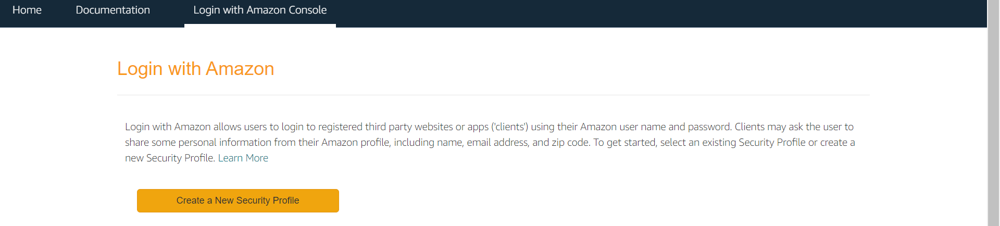
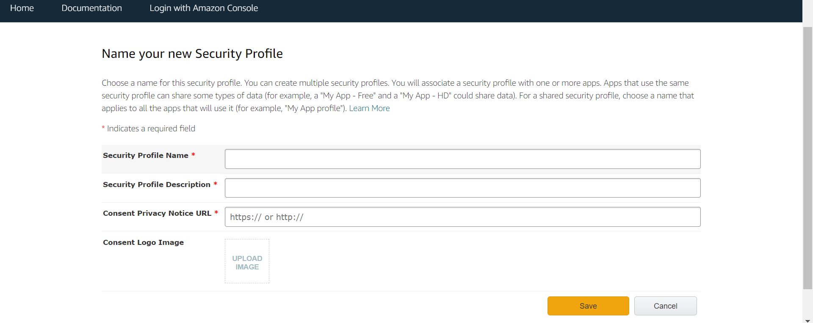
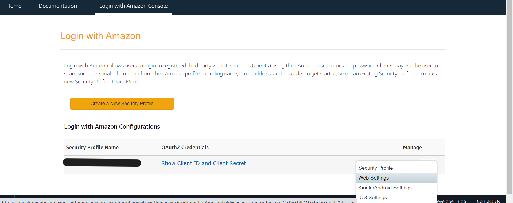
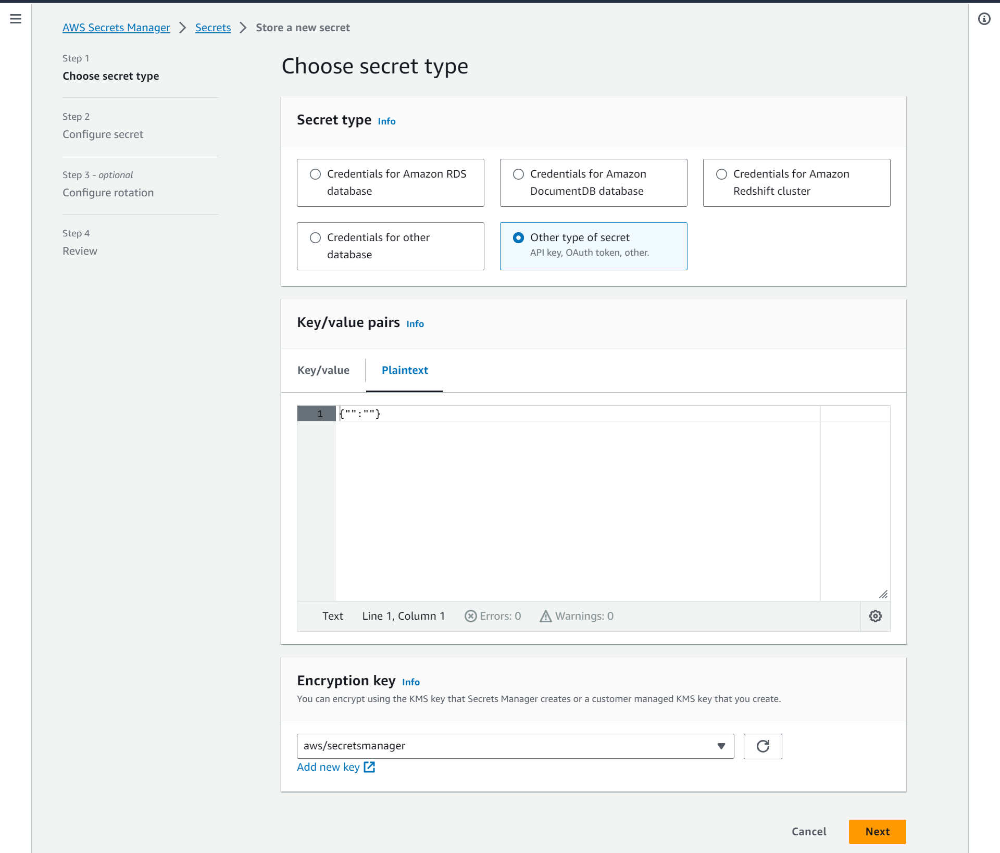
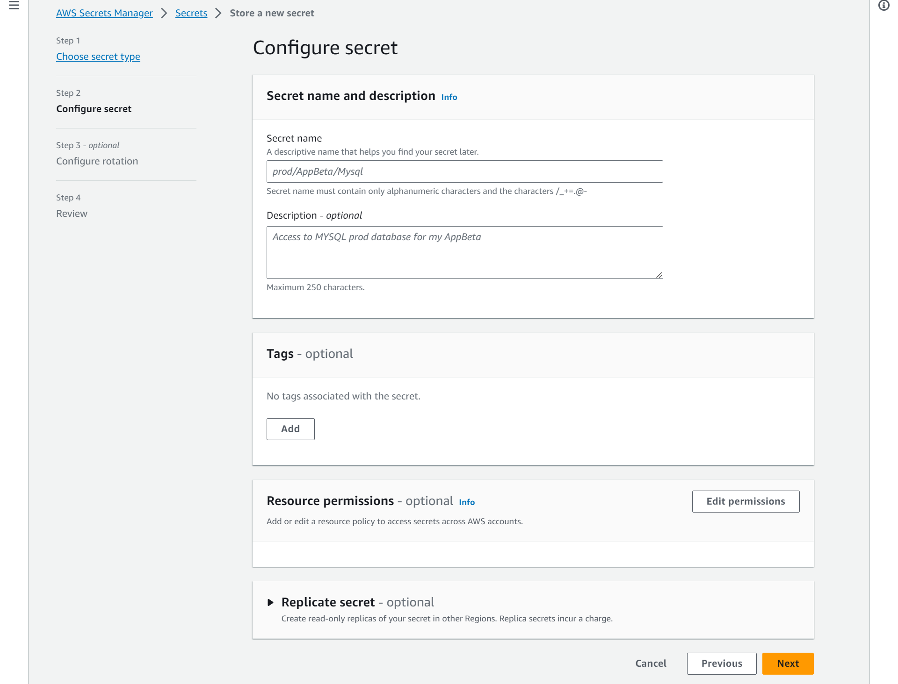
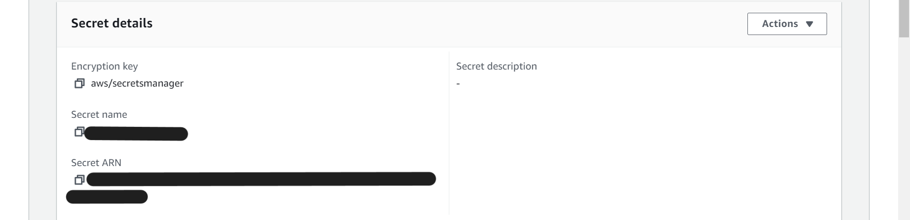

# Deployment walkthrough

## Table of Contents
- [Deployment walkthrough](#deployment-walkthrough)
  - [Table of Contents](#table-of-contents)
  - [Requirements](#requirements)
  - [Pre-Deployment](#pre-deployment)
    - [Customize Static Website Content](#customize-static-website-content)
    - [Set Up Pinecone Index **(Optional)**](#set-up-pinecone-index-optional)
  - [Deployment](#deployment)
    - [Step 1: Clone The Repository](#step-1-clone-the-repository)
    - [Step 2: CDK Deployment](#step-2-cdk-deployment)
      - [**Extra: Taking down the deployed stacks**](#extra-taking-down-the-deployed-stacks)
    - [Step 3: Uploading the configuration file](#step-3-uploading-the-configuration-file)

## Requirements

Before you deploy, you must have the following installed on your device:

- [git](https://git-scm.com/downloads)
- [AWS Account](https://aws.amazon.com/account/)
- [GitHub Account](https://github.com/)
- [Amazon Developer Account](https://developer.amazon.com/)
- [AWS CLI](https://aws.amazon.com/cli/)
- [AWS CDK](https://docs.aws.amazon.com/cdk/latest/guide/cli.html)
- [npm](https://docs.npmjs.com/downloading-and-installing-node-js-and-npm)*

If you are on a Windows device, it is recommended to install the [Windows Subsystem For Linux](https://docs.microsoft.com/en-us/windows/wsl/install) (WSL), which lets you run a Linux terminal on your Windows computer natively. Some of the steps will require its use. [Windows Terminal](https://apps.microsoft.com/store/detail/windows-terminal/9N0DX20HK701) is also recommended for using WSL.

*It is recommended to use a npm version manager rather than installing npm directly. For Linux, install npm using [nvm](https://github.com/nvm-sh/nvm). For Windows, it is recommended to use WSL to install nvm. Alternatively, Windows versions such as [nvm-windows](https://github.com/coreybutler/nvm-windows) exist.

## Pre-Deployment

### Create Amazon Developer Account ###
To deploy the voice assistant, you will need an Amazon developer account. Go to [Amazon Developers Portal](https://developer.amazon.com/), and create your account.

Once you create an account, you can log into the Amazon Developer Console. Your console should look like the image below:



On your console, click `Alexa Skills Kit` to open up the Alexa Developer Console, and then click on the "Settings" tab. You should see your `Vendor ID` listed in the "My IDs" section. Please note down this value somewhere.

### Create Login With Amazon (LWA) Security Profile ###
Next, you will need to create a security profile for LWA under the same Amazon account you plan to use when creating the Alexa Skill.

Navigate back to the Amazon Developer Console, then click the `Login with Amazon` tab on top of the screen. This opens up the Login With Amazon Console. 


Click the `Create a New Security Profile` button, and fill out the form.

Freely set your profile name and description, and set Consent Privacy Notice URL to `https://example.com/privacy`, since you won't need this URL. 
After you fill out all the required fields, click "Save".

Your newly created security profile should now be listed. To edit its settings, hover over the gear icon located on the right of the profile name, and click "Web Settings".


Click the "Edit" button, and add the following URL to the "Allowed Return URLs" field.
- http://127.0.0.1:9090/cb
- https://ask-cli-static-content.s3-us-west-2.amazonaws.com/html/ask-cli-no-browser.html

After adding them, click the "Save" button to save your changes, and click the "Show Secret" button to reveal your Client Secret. Please note down both the `Client ID` and `Client Secret`.

**Get Refresh Token from ASK CLI**
Your `Client ID` and `Client Secret` allow you generate a refresh token for authenticating with the Alexa SKills Kit.

Navigate to your local terminal and run the following command, replacing `<your Client ID>` and `<your Client Secret>` with your original values:
```bash
ask util generate-lwa-tokens --client-id "<your Client ID>" --client-confirmation "<your Client Secret>" --scopes "alexa::ask:skills:readwrite alexa::ask:models:readwrite" --no-browser
```
Follow the instructions on the console. Once you are done, the credentials, including your refresh token, should be printed. Note the value of your refresh token.

### Add your credentials to AWS Secrets Manager ###
Since CDK requires access to the Alexa Developer credentials we just generated, we need to secretly store these values so that your account information remains private and isn't publicly viewable. 

Please navigate to the AWS Secrets Manager Console. Click the "Store a new secret" button, and enter the necessary information.

- For the `Secret Type` field, choose `Other type of secret`.
- For the `Key/Value pairs` field, select `Plaintext`. Then paste the following values, replacing the values enclosed by angle brackets `<>`.
    ```bash
    {
        "vendor-id": "<Your Vendor ID>"
        "client-id": "<Your Client ID>",
        "client-secret": "<Your Client Secret>",
        "refresh-token": "<Your Refresh Token>"
    }
    ```
After filling out those fields, click on `Next` to proceed.


Now enter your secret name. This can be anything you like.  
**Please leave the rest of the form blank, and simply move on by clicking `Next`.**  
**You do not have to edit anything in step 3: `Configure Rotation` section.**

After entering all necessary information, review them and create your secret by clicking the `Store` button.

Go back to the Secrets Manager Console, and click on the secret name you just created. 

Under the `Secret details` section, you can see your Secret ARN. Copy down this value.


## Deployment 

### Step 1: Clone The Repository

First, clone the GitHub repository onto your machine. To do this:

1. Create a folder on your computer to contain the project code.
2. For an Apple computer, open Terminal. If on a Windows machine, open Command Prompt or Windows Terminal. Enter into the folder you made using the command `cd path/to/folder`. To find the path to a folder on a Mac, right click on the folder and press `Get Info`, then select the whole text found under `Where:` and copy with ⌘C. On Windows (not WSL), enter into the folder on File Explorer and click on the path box (located to the left of the search bar), then copy the whole text that shows up.
3. Clone the github repository by entering the following:

```bash
git clone https://github.com/UBC-CIC/student-advising-voice-assistant.git
```

The code should now be in the folder you created. Navigate into the root folder containing the entire codebase by running the command:

```bash
cd student-advising-voice-assistant
``` 

### Step 2: CDK Deployment

It's time to set up everything that goes on behind the scenes! For more information on how the backend works, feel free to refer to the Architecture Deep Dive, but an understanding of the backend is not necessary for deployment.

Note that this CDK deployment was tested in `ca-central-1` regions only.

**Download Requirements**  
Install requirements with npm:
```npm install```

**Configure the CDK deployment**  

**Initialize the CDK stacks**
(required only if you have not deployed any resources with CDK in this region before)

```bash
cdk synth --profile your-profile-name
cdk bootstrap aws://YOUR_AWS_ACCOUNT_ID/YOUR_ACCOUNT_REGION --profile your-profile-name
```

**Deploy the CDK stacks**  
You may run the following command to deploy the stacks all at once. Please replace `<profile-name>` with the appropriate AWS profile used earlier. 

```bash
cdk deploy --all --profile <profile-name>
```
