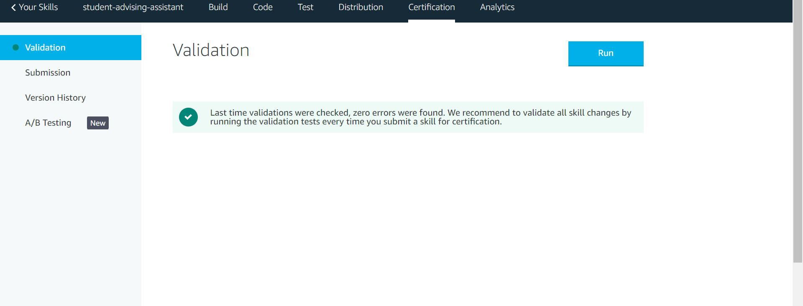

# User Guide #
**Before continuing with the User Guide, please make sure you have deployed the application.**
- [Deployment Guide](./DeploymentGuide.md)

| Index | Description |
| ----- | ----------- |
| [Local Computer](#local-computer) | How to test the behavior of the application in Alexa Developer Console |
| [Alexa Devices](#alexa-devices) | How to use the voice assistant on Alexa devices | 
| [Publish Your Skill](#publish-your-skill) | How to publish your Alexa Skill |

## Local Computer ##
You will be able to test out the behavior of the application on [Alexa Developer Console](https://developer.amazon.com/alexa/console/ask).   
When you log into the console, you should see a skill named `student-advising-assistant`.
From the `ACTIONS` dropdown menu on the right, choose `Test` and proceed.

You will be navigated to this console.  
Select `Development` in the top-left dropdown menu, and you can now start testing out its behavior.  
The left section of the console shows the interaction dialogs. Please type in `open student advising` to invoke the skill and start the conversation with Alexa. 

## Alexa Devices ##

**Now it's time to test your skill on an Alexa-integrated device!**  

At this point, you can only use your skill on Alexa devices associated with your Amazon Developer account. Therefore, when you set up the device make sure to first sign in with your Amazon Developer account.

After you sign in with your account, you can boot up the skill by saying `Alexa, open student advising`. 

## Publish Your Skill ##
At this point, your voice assistant application can only be used in Alexa devices associated with your Amazon Developer account. To make it available for anyone, **you will need to publish your Alexa skill to the Alexa skill store**.

To publish your skill, go to the [Alexa Developer Console](https://developer.amazon.com/alexa/console/ask), log in if needed, and choose your skill and click on `Certification` from the top menu bar.

  
Your screen should now look like the screenshot above. 

Then, click on the `Submission` menu from the side bar and click on `Submit for review` to submit your skill for approval.   
Once your skill passes the certification, you will be given a link. You can share it with other users so that they can enable your skill and use it on their Echo device.
