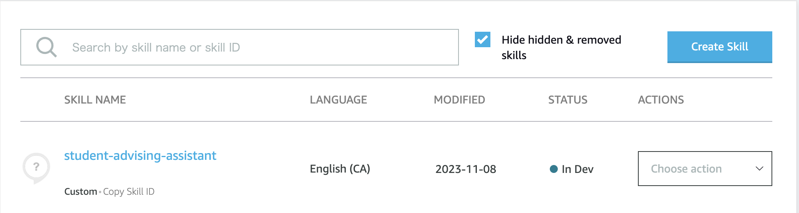
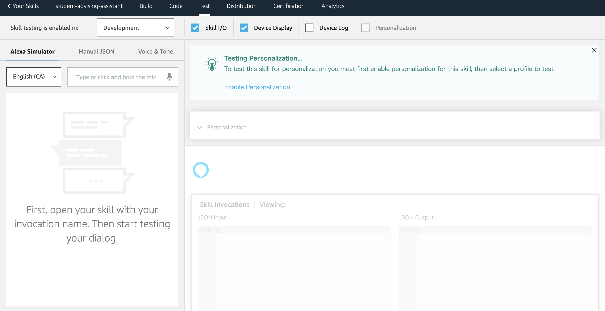

# User Guide #
**Before continuing with this User Guide, please make sure you have deployed the application.**
- [Deployment Guide](./DeploymentGuide.md)

| Index | Description |
| ----- | ----------- |
| [Local Computer](#local-computer) | How to test the behavior of the application in Alexa Developer Console |
| Alexa Devices| How to use the voice assistant on Alexa devices | 

## Local Computer ##
You will be able to test out the behavior of the application on [Alexa Developer Console](https://developer.amazon.com/alexa/console/ask).   
When you log into the console, you should see a skill named `student-advising-assistant`.
From the `ACTIONS` dropdown menu on the right, choose `Test` and proceed.

You will be navigated to this console.  
Select `Development` in the top-left dropdown menu, and you can now start testing out the behavior.  
The left section of the console shows the interaction dialogs. Please type in `open student advising` to invoke the skill and start the conversation with Alexa. 